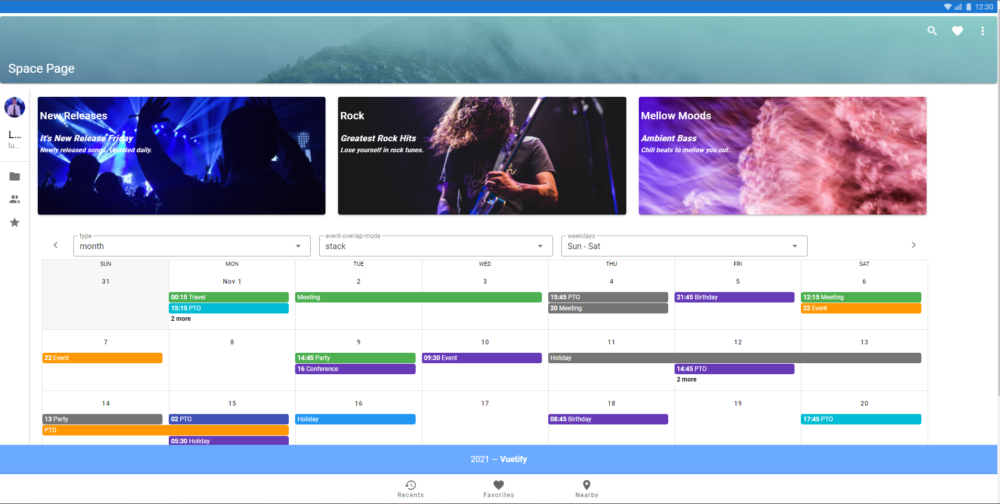

# Project Vue

<h1  >
    

</h1>

## 📃 **About**

&nbsp;&nbsp;&nbsp;&nbsp;This is a project created in order to learn more about the **Vue.js** framework, trying to develop a basic page using its tools

 

---

## 🛠 **technologies used**

The project was developed using the following technologies:

- Node.js
- HTML
- CSS
- Javascript
- Vue.js
- Vuetify

--- 

 ## ⚙ **Requirements**

These are the requirements to run the project on your machine.

- Node.JS >= 10.16.2
- Yarn >= 1.17.3
- NPM >= 6.9.0

## **How to test the project** 🔧

To reproduce what the project has to offer, you must have:

- [NodeJs](https://nodejs.org/en/download/)
- [Yarn](https://classic.yarnpkg.com/en/docs/install/#windows-stable)
- [Git](https://git-scm.com/downloads)&nbsp;( Para clonar o repositório )

First you need to clone the repository on your machine using the command below in your terminal **git bash**.

`git clone https://github.com/Jornay/vue-desenv-web.git`

 
After that, go to the terminal where the folder where the project was cloned and download all the dependencies used with the simple command:

`npm install`

or

`yarn install`

 
-- Finally, just type the start command on your terminal, being in the path of the cloned project:

`npm run serve`

And it's working on your machine! 🚀🚀
 
 

---
### Developed by [Lucas de Abreu](https://github.com/Jornay) 
